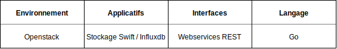

# Cahier des charges de l'outil Influxdb
## Introduction générale

### Mots clés




### Introduction et contexte

Au sein de la Division des Méthodes et Outils de Développement du bureau SI-1A 
(DGFIP), l'équipe SODA met à disposition de l'ensemble des MOE de la DGFIP une 
forge de développement, des services d'intégration continue et des services 
socles pour les environnement `Openstack`.

L'un de ces services concerne la mise à disposition d'une instance `Influxdb` 
pré-configurée. L'objectif principal de cette prestation est la mise en place 
de l'outillage de sauvegarde et de restauration de `Influxdb` avec un service de 
stockage objets `Swift`.

### Objet de la prestation

L’objet de cette prestation est la fourniture d’un binaire statique et de son 
code source permettant la sauvegarde et la restauration de `Influxdb`. Les 
spécifications et les livrables attendus sont décrits dans les chapitres 
suivants.

Lors de la première phase de la prestation (environ une semaine), l’expertise 
de l’intervenant devra permettre de préciser les spécifications pour atteindre 
l’objectif de produire des livrables opérationnels dans un délai maximum de 6 
mois.

Ensuite, l'intervenant écrira et proposera ses tests unitaires et ses jeux de 
d'essais afin de pouvoir réaliser une couverture de code de 100% tout en 
assurant les fonctionnalités demandées

La validation du fonctionnement de l'outil sera réalisée de manière 
automatisée. Les actions d'intégration continue, de tests,de livraisons et de 
gestion de projet seront visibles dans le dépôt Github (`issues`, 
`pull requests`, `kanban`…).

### Conditions d’intervention

- La prestation sera principalement réalisée au 4 avenue Montaigne 93468 
NOISY-LE-GRAND. 
- Cependant certains travaux ne nécessitant par l’accès aux ressources DGFiP 
pourront être réalisés hors site.

### Évaluation financière

Il est demandé au prestataire de fournir les UO correspondantes à ce cahier des 
charges et d’indiquer les modalités de garantie.  
Commande N° XX, "Fourniture d’un outil de sauvegarde et de restauration de 
Graylog et InfluxDB".

### Calendrier de la prestation et lieu d’exécution

La prestation pourra se dérouler à compter du XX/XX/2020, après notification du 
bon de commande

## Description fonctionnelle


 
L'outil fournira trois macro-fonctions:

- sauvegarder ;
- restaurer ;
- fournir un état de la sauvegarde.

##  Objectifs détaillés

Un synopsis est fourni dans les chapitres suivants pour détailler le 
comportement attendu.

### Sauvegarder

La partie "sauvegarde" va permettre de: 

- récupérer par l'intermédiaire de l'`API` les messages stockés dans `Influxdb` 
par lot d'une minute en se basant sur l'horodatage desdits messages ;
- nettoyer ces messages des méta-données de `Influxdb` afin qu'ils correspondent 
à des messages bruts prêts à être renvoyés dans `Influxdb` en utilisant le 
protocole `GELF over HTTP`;
- stocker ces messages dans un conteneur Swift, regroupés par minute en se 
basant sur leur horodatage. Chaque objet stocké contient un tableau JSON de 
messages.

### Restaurer

La partie "restauration" va permettre de:

- récupérer les messages depuis les objets stockés précédemment ;
- rejouer leur insertion dans Influxdb par l'entrée `XXXXXXXXXXXXXXXXX`.

### État de la sauvegarde

La partie "état de la sauvegarde" ou "statut" va permettre de:

- afficher le delta entre Influxdb et la sauvegarde (le temps en heures minutes) 
des messages stockés ;
- afficher les dates du premier et dernier message stockés dans `Influxdb` et 
`Swift`.

### Évolutions futures et facilité de maintenance

L'architecture de l'application doit être prévue pour permettre facilement 
l'ajout de fonctionnalités (sous-commandes) aux trois macro-fonctions 
présentées. En effet, une future version de l'application permettra de 
sauvegarder les éléments créés par les utilisateurs (tableaux de bord, 
alertes…).

Par exemple: `irec backup dashboard`.

## Description détaillée

### Synopsis

```bash
# Utilisation de la fonction "backup".
# Version "lisible par un humain".
$ irec -f human backup messages <options influxdb> <options swift>
	Delay:
		3 days, 6 hours, 24 minutes

	Starting backup...
		2020-01-01 from 08:00:00 to 08:01:00... OK
		2020-01-01 from 08:01:00 to 08:02:00... OK
		2020-01-01 from 08:02:00 to 08:03:00... OK
		2020-01-01 from 08:03:00 to 08:04:00... OK
[…]

	Success:
		3000 messages
		8 minutes 15 seconds spent to backup
$ echo $?
0

# Version "JSON": un message JSON par ligne, affichage au fil de l'eau.
$ irec -f json restore <options influxdb> <options swift>
{"action":"backup","delay":{"days": 3,"hours":6,"minutes":24}}
{"action":"backup","from":"2020-01-01 08:00:00","to":"2020-01-01 08:01:00","status":"ok"}
{"action":"backup","from":"2020-01-01 08:01:00","to":"2020-01-01 08:02:00","status":"ok"}
{"action":"backup","from":"2020-01-01 08:02:00","to":"2020-01-01 08:03:00","status":"ok"}
{"action":"backup","from":"2020-01-01 08:03:00","to":"2020-01-01 08:04:00","status":"ok"}
[…]
{"action":"restore","status": "success","messages": 3000, "time":{"hours":0, "minutes": 8, "seconds":15}}
$ echo $?
0
$
```

```bash
# Utilisation de la fonction "restore".
# Version "lisible par un humain", affichage au fil de l'eau.
$ irec -f human restore messages  <options influxdb> <options swift>
	Delay:
		3 days, 6 hours, 24 minutes

	Starting restore...
		2020-01-01 from 08:00:00 to 08:01:00... OK
		2020-01-01 from 08:01:00 to 08:02:00... OK
		2020-01-01 from 08:02:00 to 08:03:00... OK
		2020-01-01 from 08:03:00 to 08:04:00... OK
[…]

	Success:
		3000 messages
		8 minutes 15 seconds spent to restore
$ echo $?
0

# Version "JSON": un message JSON par ligne, affichage au fil de l'eau.
# La version "pretty JSON" n'est pas affichée pour alléger la lecture du 
# document mais sera également implémentée.
$ irec -f json restore messages <options influxdb> <options swift>
{"action":"restore","delay":{"days": 3,"hours":10,"minutes":24}}
{"action":"restore","from":"2020-01-01 08:00:00","to":"2020-01-01 08:01:00","status":"ok"}
{"action":"restore","from":"2020-01-01 08:01:00","to":"2020-01-01 08:02:00","status":"ok"}
{"action":"restore","from":"2020-01-01 08:02:00","to":"2020-01-01 08:03:00","status":"ok"}
{"action":"restore","from":"2020-01-01 08:03:00","to":"2020-01-01 08:04:00","status":"ok"}
[…]
{"action":"restore","status": "success","messages": 3000, "time":{"hours":0, "minutes": 8, "seconds":15}}
$ echo $?
0
$
```

```bash
# Utilisation de la fonction "status".
# Version "lisible par un humain", affichage au fil de l'eau.
$ irec -f human status messages <options influxdb> <options swift>
	influxdb: 
		first message: 2019-01-01 08:00:00
		last message:  2020-01-04 09:00:00

	Swift:
		first message: 2019-01-01 08:00:00
		last message:  2019-12-31 22:57:00

	Delay:
		3 days, 10 hours, 3 minutes
$ echo $?
0

# Version "pretty JSON": un tableau contenant le résultat.
# La version "JSON" n'est pas affichée pour alléger la lecture du document 
# mais sera également implémentée.
$ irec -f pretty-json status messages <options influxdb> <options swift>
{
	"status": {
		"influxdb": {
			"first message": "2019-01-01 08:00:00",
			"last message": "2020-01-04 09:00:00"
		},
	    "swift": {
			"first message": "2019-01-01 08:00:00",
			"last message":  "2019-12-31 22:57:00"
		},
		"delay": {
			"days": 3,
			"hours": 10
		}
	}
}
$ echo $?
0
$
```

Options:

* Influxdb:

  * `--influxdb-api`: URL du webservice de `Influxdb`
  * `--influxdb-token`: token utilisé pour interroger le webservice de `Influxdb`
  * `--influxdb-container` : nom du conteneur `Swift` à utiliser pour les 
  sauvegardes

* swift, ces options définies sont complémentaires d'éventuelles variables 
d'environnement normalisées pour tout client `Openstack` utilisant la `SDK` 
officielle:

  * `--swift-os-auth-url` : variable du client openstack
  * `--swift-os-cacert` :  variable du client openstack
  * `--swift-os-identity-api-version` : variable du client openstack
  * `--swift-os-interface` : variable du client openstack
  * `--swift-os-password` : variable du client openstack
  * `--swift-os-project-id` : variable du client openstack
  * `--swift-os-project-name` : variable du client openstack
  * `--swift-os-region-name` : variable du client openstack
  * `--swift-os-username` : variable du client openstack
  * `--swift-os-user-domain-name` : variable du client openstack

* format:

  * `--format` / `-f` : format de l'affichage de la sortie standard, valeurs
  possibles:
    * `human`: format lisible par un humain tel que décrit dans le synopsis ;
    * `json`: format JSON brut correspondant au format `human`.
    * `pretty-json`: format JSON indenté correspondant au format `human`.

* aide:

  * `--help` / `-h` : cette option peut être utilisée pour afficher l'aide de 
  l'outil, de chaque commande et sous-commande de l'outil.

Pour la sortie `human`, les terme `OK` ou `SUCCESS` (minuscules ou majuscules)
affichés lors des processus de sauvegarde et de restauration sont écrits en 
vert (succès), les termes `KO` ou `FAILED` (minuscules ou majuscules) en rouge 
(échec / erreur). Les alertes non bloquantes sont en jaune.

### Codes et sorties

Le succès de la commande retourne 0, 1 sinon.

### Stockage des données

Chaque jour est un répertoire contenu dans la racine du conteneur dont le nom 
est au format `AAAA-MM-JJ` (année-mois-jour). Il contient un fichier JSON par 
minute sauvegardée.

Exemple d'arborescence du conteneur `logs`:

```
logs
├── 2020-01-01
│   ├── 00:00 - 00:01.json
│   └── 00:01 - 00:02.json
└── 2020-01-02
    ├── 00:00 - 00:01.json
    └── 00:01 - 00:02.json
```

## Livraisons et tests

### Forme du livrable

Le livrable se présente sous la forme:

*  d'un code source `Go` documenté capable de générer un executable binaire 
statique. En effet, il doit être indépendant du système d'exploitation sur 
lequel il est installé. De plus, la quantité de données à traiter peut être 
très élevée:

    * de bonnes performances sont requises (estimation à 360000 messages par 
    minute en pic) ;
    * un langage compilé est souhaité (`Go`) ;
    * les bibliothèques externes doivent être disponibles sur des dépôts `git` 
    public afin de les rapatrier en interne et pouvoir continuer à construire 
    sans connexion internet ;

* d'un fichier `Makefile` capable de piloter les étapes de tests et de 
construction ;

* d'une documentation au format `Markdown` de l'architecture du logiciel et de 
son utilisation.

Le code source et la documentation du livrable sont fournis au fil de l'eau 
par l'intermédiaire de `pull requests`.

### Tests automatisés

Le prestataire branchera son moteur d'intégration continue sur son dépôt 
`Github`, `fork` du projet de la 
[DGFiP](https://github.com/139bercy/influxdb-recovery), afin que le client 
puisse suivre en temps réel les développements.
